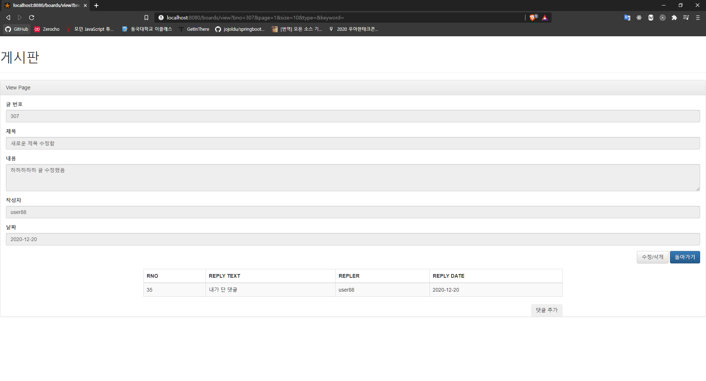

# Start_Spring_Boot

Start Spring Boot(남가람북스 출판, 구멍가게 코딩단 지음) 책 공부

## 프로젝트 - 게시판 프로젝트

### 1. 개요

- SpringBoot, Mysql, Spring Data JPA, 그리고 Thymeleaf을 사용한 Spring MVC 패턴 적용
- Spring Security를 사용한 로그인 처리, Interceptor을 사용하여 로그인 직후 기존 목표 페이지로의 이동 구현
- 데이터베이스를 이용한 remember-me 구현
- 페이징 처리
- JPQL과 QueryDSL을 사용한 동적 쿼링

### 2. 데이터베이스 구성

- Board - Reply = N : 1(양방향 연관관계로 구현)
- Member - MemberRole = N : 1(단방향 OneToMany 연관관계로 구현)

### 3. 구현 화면

1. 메인 화면 : 게시글 확인 및 댓글 개수 확인
   

2. 로그인 화면 : 미로그인 상태에서 글쓰기 버튼 클릭시 로그인 버튼으로 이동
   

3. 게시글 작성 화면 : Interceptor을 사용하여 바로 게시글 작성 페이지로 이동, 작성 후 메인 페이지로 이도
   
   

4. 게시글 상세보기 및 댓글 확인 : 로그인한 사용자가 작성하지 않은 게시글 클릭시 수정/삭제 버튼 없음
   
5. 게시글 상세보기 및 수정 : 본인이 작성한 게시글의 경우 수정/삭제 버튼 존재, 수정 가능
   
   
   
6. 댓글 추가
   
   

7. 게시글 검색 : 제목, 내용, 작성자에 대해서 검색 가능
   
   

8. 페이징 처리 : 10개의 게시글로 페이징 처리, 총 10개 페이지가 한 번에 보임. 페이지 위치에 따라 이전/다음 버튼 확인 가능
   
   

9. 게시글 삭제 : 게시글을 삭제할 때 게시글의 댓글을 cascade하게 삭제
   
